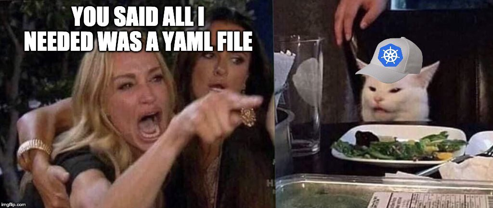

# dollop

This is my self-hosting attempt with k8s. My goals are:

- host public and private things for me and my friends
- spend less time maintaining the boring stuff
- learn k8s

Some of the boring stuff is solved with automation, such as:

- declarative workflow rather than procedural
- [argocd][4] continously checks out this repo and basically runs `kubectl apply --recursive -f manifests` for me
- [renovatebot][5] is monitoring this repo for outdated things and makes pull requests itself

### Wanna help?
Feel free to suggest anything that improves or adds to this setup, just open an issue.

### Forks
If you fork, make sure to also fork [dollop-secrets][1] and <ins>make it private</ins>.

At the moment you'd have to change a bunch of things after a fork, like [prep/hosts][2], [prep/k0sctl.yml][3], and basically any domain mentioned in `manifests`. I'm sorry about this, I'll think of a way to improve this in the future.

PS use my [updown.io][6] referral, thank you~

[1]: https://github.com/cinnamondoll/dollop-secrets
[2]: prep/hosts
[3]: prep/k0sctl.yml
[4]: https://github.com/argoproj/argo-cd
[5]: https://github.com/renovatebot/renovate
[6]: https://updown.io/r/DnQTP
